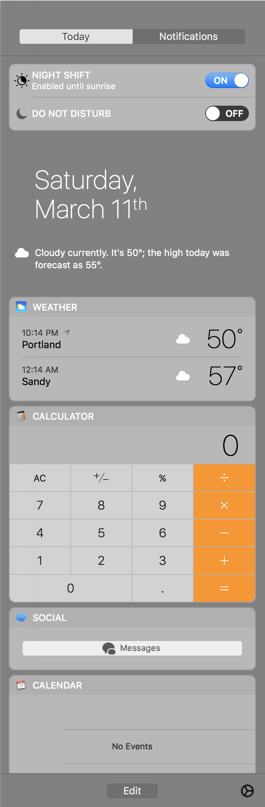

# darkNC

 

# Information:

- Designed for macOS 10.12 and 10.13
- darkNC is a MacForge plugin that brings dark mode to Notification Center on macOS   
- Author: [w0lfschild](https://github.com/w0lfschild)

# Note:

- None

# Installation:

1. Download and open [MacForge](https://github.com/w0lfschild/app_updates/raw/master/MacForge/MacForge.zip)
2. Install [darkNC](https://www.macenhance.com/mflink?macforge://github.com/w0lfschild/myRepo/raw/master/mytweaks/org.w0lf.darkNC)
3. Open `Terminal.app` and run the command `killall NotificationCenter`
4. Open `Preferences.app` got to `General` and check `Use dark menu bar and Dock`
5. Open the Notification Center
	
### License:
Pretty much the BSD license, just don't repackage it and call it your own please!    
Also if you do make some changes, feel free to make a pull request and help make things more awesome!
